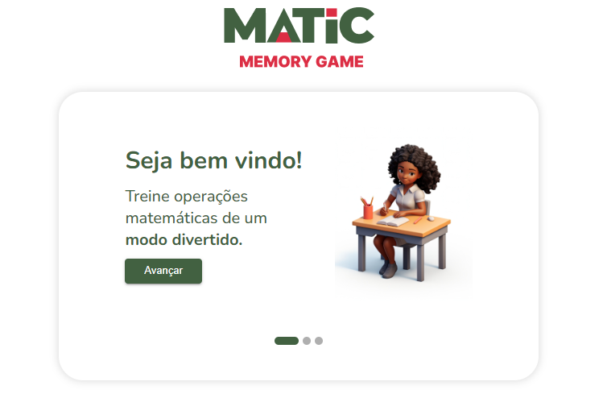

# Math Games Hub

## Descrição
O Math Games Hub é um projeto open source que visa auxiliar alunos e professores no desenvolvimento de habilidades matemáticas em crianças e adolescentes com discalculia e outras neurodivergências. O hub permite que desenvolvedores criem e publiquem jogos matemáticos educativos.

## Índice
- [Motivação](#motivação)
- [Recursos e Funcionalidades](#recursos-e-funcionalidades)
- [Capturas de Tela](#capturas-de-tela)
- [Tecnologias Utilizadas](#tecnologias-utilizadas)
- [Instalação e Configuração](#instalação-e-configuração)
- [Como Contribuir](#como-contribuir)
- [Licença](#licença)
- [Agradecimentos](#agradecimentos)

## Motivação
O projeto foi criado para fornecer uma ferramenta eficaz e acessível para o ensino de matemática, especialmente para alunos com dificuldades de aprendizado devido a discalculia e outras neurodivergências.

## Recursos e Funcionalidades
- Jogos de matemática interativos.
- Personalização de níveis de dificuldade.
- Suporte para diferentes operações matemáticas (adição, subtração, multiplicação, divisão).
- Interface amigável e acessível.

## Capturas de Tela



## Tecnologias Utilizadas
React, TypeScript, Redux, MUI

## Instalação e Configuração
```bash
git clone https://github.com/MatheusFPalma/hub-matematico
cd hub-matematico
npm install
npm start
```

## Como Contribuir
1. Faça um fork do projeto.
2. Crie uma branch para a sua feature (`git checkout -b feature/nome-da-feature`).
3. Commit suas mudanças (`git commit -m 'Adiciona nova feature'`).
4. Push para a branch (`git push origin feature/nome-da-feature`).
5. Abra um Pull Request.

Para mais detalhes, consulte o nosso [Guia de Contribuição](link-para-guia).

## Licença
Este projeto está licenciado sob a Licença MIT - veja o arquivo [LICENSE](./LICENSE) para mais detalhes.


## Agradecimentos

Agradecimento especial à [Vitória Santos](https://www.linkedin.com/in/vit%C3%B3ria-santos-23a6421bb/) e a [Growdev](https://www.linkedin.com/company/growdev/mycompany/) por organizarem o hackaton e proporcionarem a oportunidade de desenvolvimento do projeto.

Colaboradores: 
UX: 
[Eudes Jonathas](https://www.linkedin.com/in/eudesjonathas-designer/)

Devs:
[Diego Lins](https://www.linkedin.com/in/diegolins-fullstack/)
[Jéssica Schmidt](https://www.linkedin.com/in/jessicaschmidtgoncalves/)
[Matheus Palma](https://www.linkedin.com/in/matheusfpalma/)
[Solange Righi](https://www.linkedin.com/in/solange-righi/)
