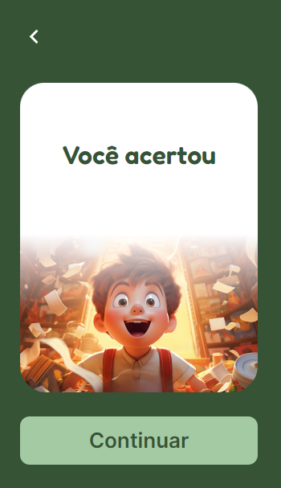

# Math Games Hub

## Description
Math Games Hub is an open-source project aimed at helping students and teachers develop math skills in children and teenagers with dyscalculia and other neurodivergences. The hub allows developers to create and publish educational math games.

## Table of Contents
- [Motivation](#motivation)
- [Features](#features)
- [Screenshots](#screenshots)
- [Technologies Used](#technologies-used)
- [Installation and Setup](#installation-and-setup)
- [How to Contribute](#how-to-contribute)
- [License](#license)
- [Contact and Support](#contact-and-support)
- [Acknowledgments](#acknowledgments)

## Motivation
The project was created to provide an effective and accessible tool for teaching math, especially for students with learning difficulties due to dyscalculia and other neurodivergences.

## Features
- Interactive math games.
- Customizable difficulty levels.
- Support for different math operations (addition, subtraction, multiplication, division).
- User-friendly and accessible interface.

## Screenshots




## Technologies Used
React, TypeScript, Redux, MUI

## Installation and Setup
```bash
git clone https://github.com/MatheusFPalma/hub-matematico
cd hub-matematico
npm install
npm start
```

## How to Contribute
1. Fork the project.
2. Create a branch for your feature (`git checkout -b feature/feature-name`).
3. Commit your changes (`git commit -m 'Add new feature'`).
4. Push to the branch (`git push origin feature/feature-name`).
5. Open a Pull Request.

For more details, see our [Contribution Guide](link-to-guide).

## License
This project is licensed under the MIT License - see the [LICENSE](./LICENSE) file for details.

## Acknowledgments

Special thanks to [Vitória Santos](https://www.linkedin.com/in/vit%C3%B3ria-santos-23a6421bb/) and [Growdev](https://www.linkedin.com/company/growdev/mycompany/) for organizing the hackathon and providing the opportunity to develop this project.

Collaborators:
UX: 
[Eudes Jonathas](https://www.linkedin.com/in/eudesjonathas-designer/)

Developers:
[Diego Lins](https://www.linkedin.com/in/diegolins-fullstack/)
[Jéssica Schmidt](https://www.linkedin.com/in/jessicaschmidtgoncalves/)
[Matheus Palma](https://www.linkedin.com/in/matheusfpalma/)
[Solange Righi](https://www.linkedin.com/in/solange-righi/)